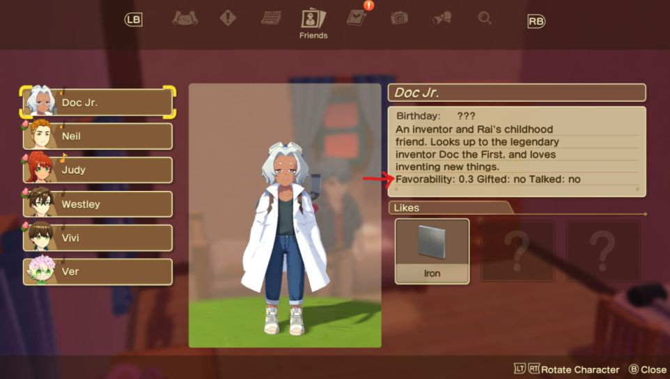

# GoonHW-WOA - A Harvest Moon: Winds of Anthos BepInEx Plugin

A WIP BepInEx plugin for Harvest Moon: The Winds of Anthos that adds a few quality of life features and enables the debug menu.

## Features

- Skip Intro Logos
- Debug menu enabler (Press right thumbstick)
- Show favorability, gift status, and talk status for NPC in the NPC menu

## Installation
1. Download BepInEx from [Here](https://github.com/BepInEx/BepInEx/releases/tag/v5.4.22)
2. Extract the archive to your Harvest Moon directory
3. Download the plugin from the releases page and extract to the `BepInEx\plugins` directory
4. Start the game at least once to generate the configuration file, and you can edit it in `BepInEx\config`
